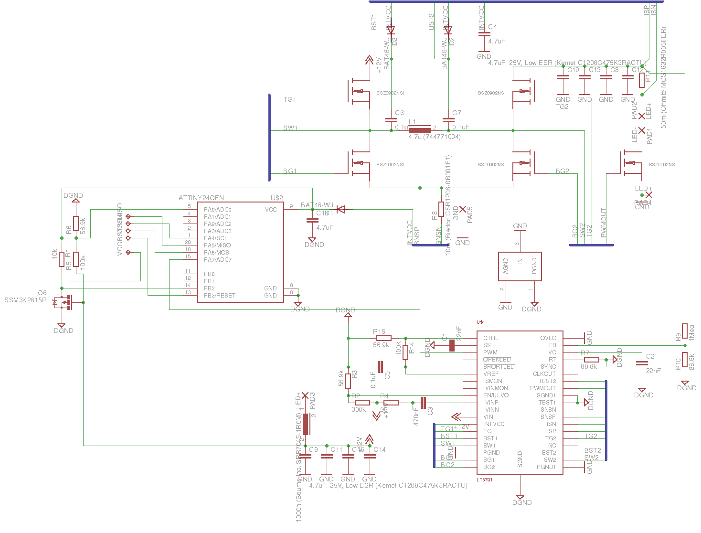

***WARNING! IT'S UNTESTED - I'VE NEVER BUILT THIS BOARD. But I will :)***

LED driver for powering Cree XHP35 LED at 1.05A from 3S LiPoly battery to use in underwater flashlight.

It's currently tuned up to work with 9-12.6V input.

Input can be easily changed to 4-25V with slight adjustment of R2 and R3. Increasing voltage over 25V is limited by used capacitors and FETs. You can change it upto ~60V with selecting new Q1-Q5, but PCB rework is also required.

Current is roughly set to 2A with R11, and is fine-tuned to 1.048A with R14&R15. Tuning R14 and R15 values makes it possible to set any current between 0-2A.

This driver is build around [LT3791](http://www.linear.com/product/LT3791)

I've also added Attiny24 to control PWM input and monitor input voltage. It can be ignored and never placed. Firmware will be added later, but the idea is to detect power loss with Q6, go to deep sleep and change working mode on power recovery. C16 gives uC ~4 seconds of life in power down mode, so we can switch power modes with one romote switch. Simulation gave me 10us for uC to go to deep sleep mode and it seems perfect.

You can download [gerbers](binaries/led_driver_12v_1a.zip?raw=true) to order this PCB from [SeedStudio](http://www.seeedstudio.com/service/index.php?r=pcb) - it's very cheap and has nice quality.

Yo'll get something liki this:

Board is 19.5x35mm and it should generate almost no heat - calculated efficiency is >96.5% and power loss is around 0.4W at 13W output.

[Part List](part_list.txt?raw=true) is also included.

You can also take a look at LTSpice IV simulation and efficiency report. Schematic and PCB created with [Eagle 7.5](http://www.cadsoftusa.com/). It's not as nice and clean as I wanted it to be, but it should do the job.

